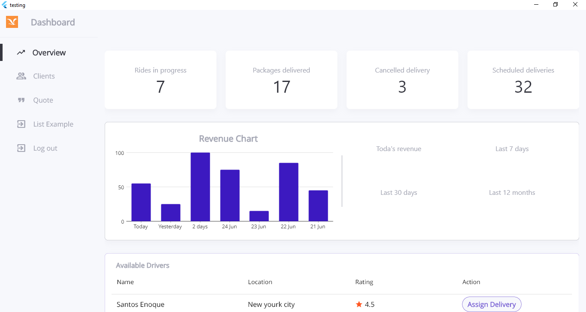

<p align="center"><a href="http://www.rajtechnologies.com" target="_blank">

</a>
</p>

## About Flutter MoonLight

Flutter Admin using Core Flutter used

## Third Party Package Used

- **[url_launcher](https://pub.dev/packages/url_launcher)**
- **[http](https://pub.dev/packages/http)**
- **[share_plus](https://pub.dev/packages/share_plus)**

## Third Party Package Used For Firebase Push Notification

- **[firebase_core](https://pub.dev/packages/firebase_core)**
- **[firebase_messaging](https://pub.dev/packages/firebase_messaging)**
- **[flutter_local_notifications](https://pub.dev/packages/flutter_local_notifications)**

## Directory Structure
```
lib
│───main.dart
│───layout.dart
│───constants
|    │──app.dart
|    └──controllers.dart
│───controllers
|    └──menu_controller.dart
|    └──navigation_controller.dart
|    └──login_controller.dart
|    └──authentication_manager.dart
│───models
|    └──requests
|       └──login_request_model.dart
|       └──register_request_model.dart
|    └──responses
|       └──login_response_model.dart
|       └──register_response_model.dart
│───pages
|    └──errors
|       └──404.dart
|    └──example
|       └──load_more_using_api.dart
|    │──home_page.dart
|    └──settings_page.dart
│───routes
|    └──router.dart
|    └──routes.dart
│───service
|    └──login_service.dart
│───utils
|    └──cache_manager.dart
|    └──local_navigator.dart
|    └──responsive.dart
|    └──tools.dart
└────widgets
|    └──avatar.dart
|    └──call-button.dart
|    └──custom_text.dart
|    └──horizontal_menu_item.dart
|    └──navbar.dart
|    └──side_menu_item.dart
|    └──side_menu.dart
|    └──vertical_menu_item.dart
|    └──cards
|       └──business-card.dart
|       └──directory-card.dart
|       └──full-data-card.dart
|       └──news-card.dart
```
## Break Point For Responsive

| Tables  |  PX   |
| ------- | :---: |
| Desktop |  992  |
| Tablet  |  768  |
| Mobile  |  576  |
| custom  | 1100  |


## Contributing

- **[Bhargav Raviya](https://github.com/bhargavraviya)**

## Maintenance by Raj Technologies Pvt Ltd (For Flutter Starter Project)

- [Raj Technologies Pvt Ltd](http://www.rajtechnologies.com/contact-web-design-development-marketing-Ahmedabad-India-Gujarat.php+).

## First Inspiration of Admin Panel

- **[Web Dashboard (Santos Enoque)](https://github.com/Santos-Enoque/flutter-web-dashboard-template)**
